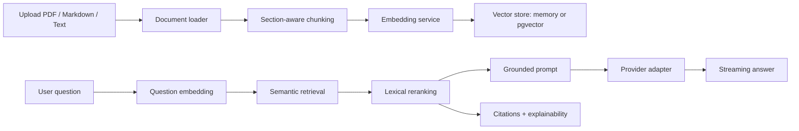

# Architecture

## Audit Summary

The first implementation had a polished UI and a useful RAG prototype, but the platform core needed hardening:

- Generation was too Gemini-centric.
- Embeddings had no provider strategy beyond Gemini plus fallback.
- Vector storage was local-only.
- Client streaming and knowledge state lived in a single large component.
- Environment variables were not validated.
- AI health, retries, caching, and provider fallback were missing.
- CI/CD, Docker, pgvector migration, and deployment docs were absent.

## Improvement Strategy

1. Preserve the premium product shell and App Router structure.
2. Move AI generation behind provider adapters.
3. Move embeddings behind provider-aware services.
4. Keep RAG orchestration centralized and typed.
5. Add pgvector support without breaking local private mode.
6. Add health, observability, retry, response cache, and status reporting.
7. Split client state into focused hooks.
8. Add production deployment and local infrastructure files.

## AI Provider Abstraction

All generation providers implement `AiProviderAdapter`:

```ts
interface AiProviderAdapter {
  id: AiProvider;
  displayName: string;
  model: string;
  stream(input: GenerateInput): AsyncGenerator<GenerationChunk>;
  health(): Promise<ProviderHealth>;
}
```

Supported providers:

- `local`
- `gemini`
- `vertex`
- `ollama`
- `openrouter`
- `openai-compatible`
- `vllm`
- `lmstudio`

The active provider is selected by `AI_PROVIDER`. The fallback provider is selected by `AI_FALLBACK_PROVIDER`.

## RAG Flow



## Local and Production Modes

Local mode needs no external services and answers only from uploaded source documents. Ollama and pgvector can run through Docker Compose.

Production mode should use:

- Vercel for the Next.js app
- Supabase Postgres with pgvector for vector storage
- Gemini, Vertex AI, OpenRouter, vLLM, or another OpenAI-compatible provider for generation
- Local or hosted embedding providers depending on security and latency requirements

## Observability

The platform includes structured server logging, status reporting at `/status`, health checks at `/api/health`, token estimates, latency metrics, provider fallback counts, and response cache hit counts.
